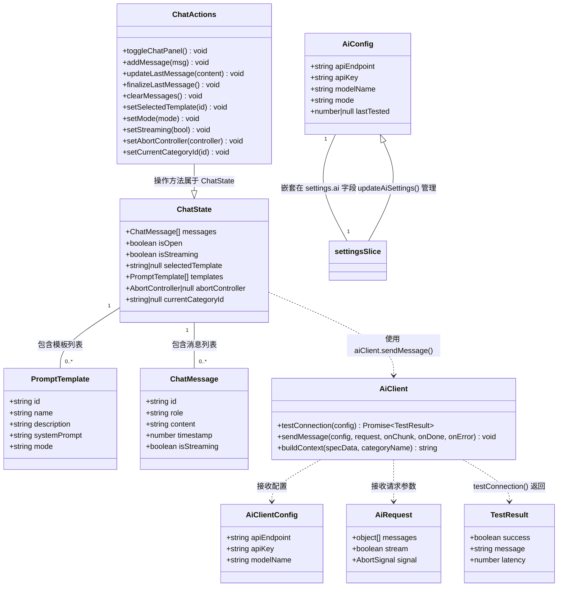
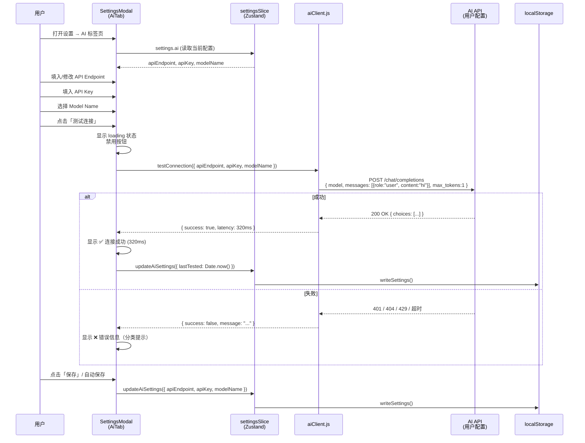
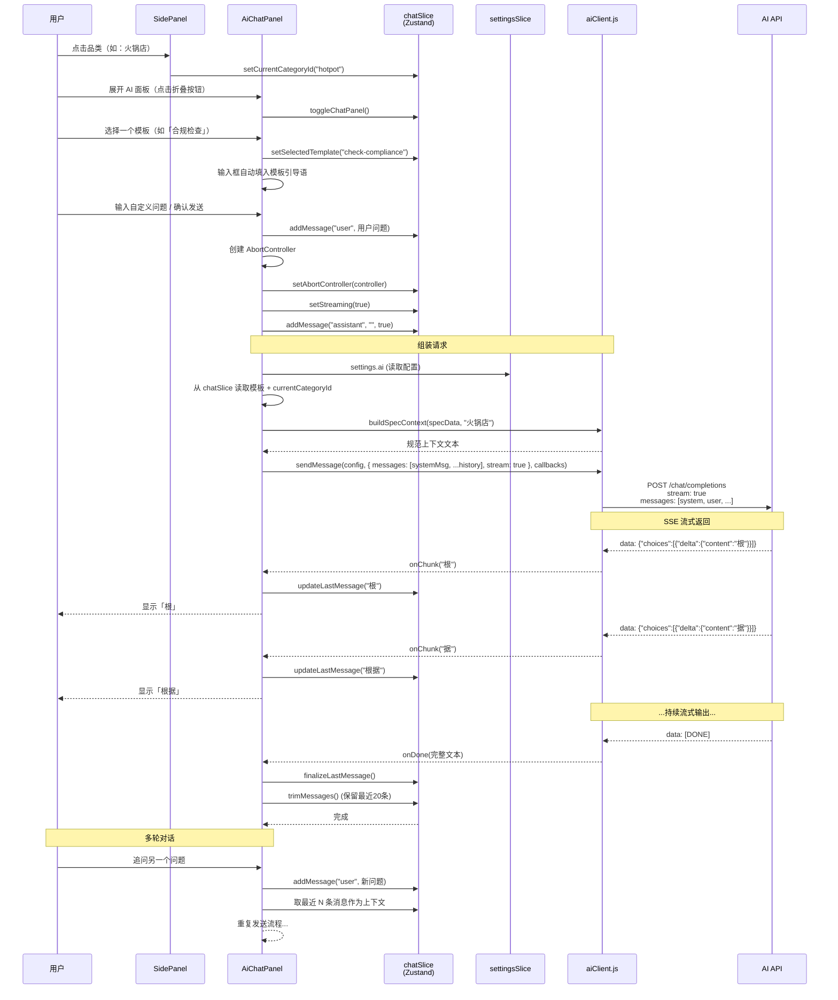
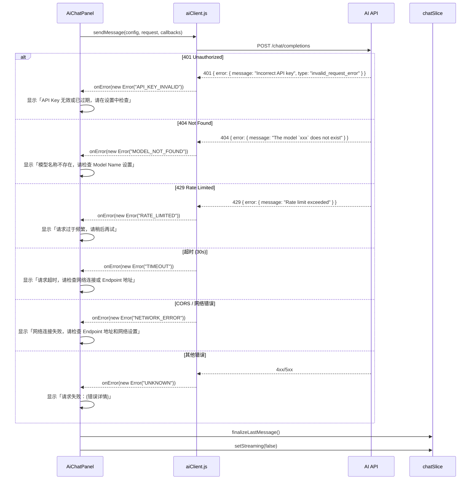
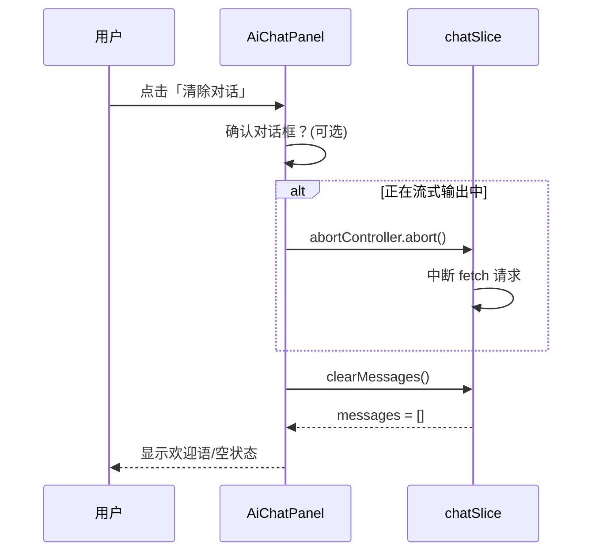
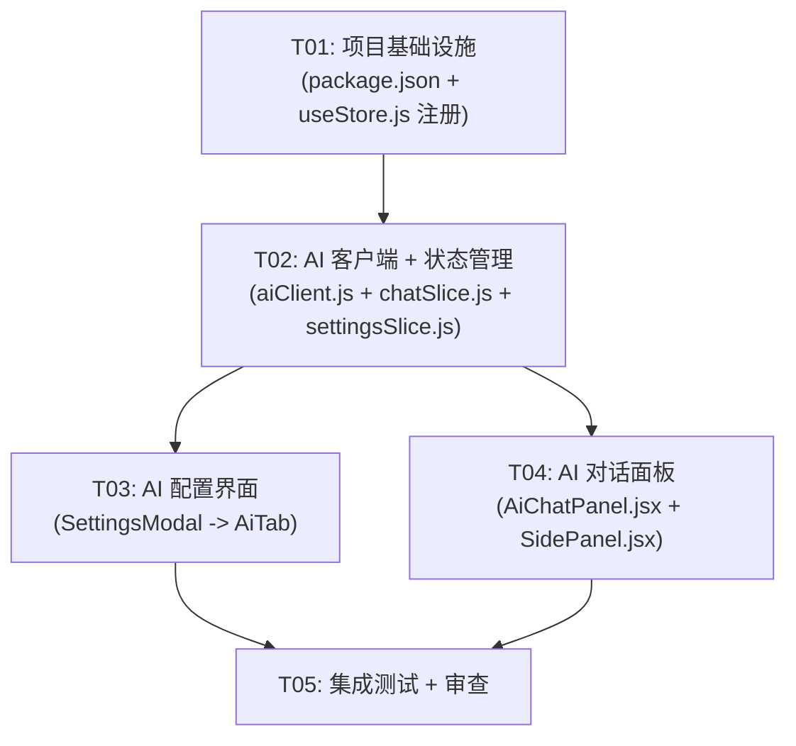

# ID Aura — AI API 集成架构设计文档

> **版本**: 2.7.0  
> **状态**: 已确认  
> **作者**: Bob (Architect)

---

## 1. 实现方案 + 框架选型

### 1.1 总体架构

纯前端方案，无需后端服务。AI API 请求从浏览器（Electron 渲染进程）直接发出。

```
┌─────────────────────────────────────────────────────┐
│  Electron 渲染进程 (Vite + React + Zustand)          │
│                                                      │
│  ┌──────────┐  ┌────────────┐  ┌──────────────────┐ │
│  │ Settings  │  │  SidePanel │  │   AiChatPanel    │ │
│  │ Modal     │  │  (增强)    │  │   (新建组件)      │ │
│  └────┬─────┘  └─────┬──────┘  └────────┬─────────┘ │
│       │              │                  │            │
│  ┌────▼──────────────▼──────────────────▼──────────┐ │
│  │              Zustand Store                       │ │
│  │  ┌──────────────┐  ┌────────────────────────┐   │ │
│  │  │ settingsSlice │  │     chatSlice (新增)    │   │ │
│  │  │ (扩展 aiConfig)│  │  messages, templates,  │   │ │
│  │  └──────────────┘  │  isStreaming...          │   │ │
│  │                     └───────────┬────────────┘   │ │
│  └─────────────────────────────────│─────────────────┘ │
│                                    │                    │
│  ┌─────────────────────────────────▼──────────────────┐ │
│  │              aiClient.js (新建)                    │ │
│  │  原生 fetch + ReadableStream + TextDecoder         │ │
│  │  testConnection() / sendMessage() / abort()        │ │
│  └─────────────────────────────────┬──────────────────┘ │
│                                    │                    │
│                                    ▼                    │
│                          OpenAI-Compatible API          │
│                     (用户配置的 endpoint / key / model)  │
└─────────────────────────────────────────────────────────┘
```

### 1.2 关键决策说明

| 决策 | 选择 | 理由 |
|------|------|------|
| AI 请求方式 | 原生 `fetch` + `ReadableStream` | 无需额外依赖；Electron 环境无 CORS 限制（`webSecurity` 可配置），可直接调用第三方 API |
| 状态管理 | Zustand `chatSlice`（新增）+ `settingsSlice`（扩展） | 项目已用 Zustand，无需引入新状态管理库；复用组合式 slice 模式 |
| 流式输出 | SSE 兼容模式（`stream: true` + `ReadableStream.getReader()`） | OpenAI/Claude/国产模型均支持标准 SSE 格式 |
| UI 组件 | 内嵌 `AiChatPanel` 于 `SidePanel` 底部 | 用户已熟悉左侧规范库面板；底部折叠区域不干扰现有功能流 |
| 配置持久化 | `localStorage`（复用现有 `readSettings`/`writeSettings` 机制） | 现有 settings 体系已支持，统一存储入口 |
| 需新增依赖 | **无** | `nanoid`（已存在）用于生成消息 ID；`fetch`/`ReadableStream` 为浏览器原生 API |

### 1.3 技术难点及应对

| 难点 | 应对方案 |
|------|----------|
| SSE 流式解析多模型兼容 | 统一解析 `data: {..."delta":...}` 格式；对非标准响应做 fallback 提取 |
| API Key 安全存储 | localStorage；Electron 环境下未来可迁移至 `safeStorage`（v2.8+） |
| 规范上下文裁剪 | 当前品类 sections 做 `JSON.stringify`，若超 6000 tokens 则只截取 high/medium 优先级的条目 |
| 对话长度控制 | 保留最近 20 条消息；每次发送前计算总 tokens（粗略估算），超过 8000 则截断早期历史 |

### 1.4 模板预设（Prompt Templates）

定义在 `chatSlice` 初始状态中的 5 个预设模板：

| ID | 名称 | 模式 | 说明 |
|----|------|------|------|
| `check-compliance` | 合规检查 | `quick` | 检查当前设计是否符合选定品类的规范 |
| `dimension-query` | 尺寸查询 | `quick` | 快速查询某类空间的尺寸/面积要求 |
| `layout-advice` | 布局建议 | `deep` | 根据空间面积和品类给出布局方案建议 |
| `conflict-check` | 冲突排查 | `deep` | 分析多项规范之间是否存在冲突 |
| `code-reference` | 法规原文 | `quick` | 查询某项规范对应的法规条文编号及说明 |

---

## 2. 文件列表

### 2.1 新增文件（3 个）

| # | 相对路径 | 用途 |
|---|----------|------|
| 1 | `src/utils/aiClient.js` | AI API 调用封装：连接测试、规范上下文拼接、SSE 流式请求、AbortController |
| 2 | `src/store/chatSlice.js` | 对话状态管理：消息列表、流式状态、模板定义、模式切换、清除对话 |
| 3 | `src/components/AiChatPanel.jsx` | AI 对话面板 UI 组件：消息气泡、输入框、模式切换、模板选择、清除按钮 |

### 2.2 修改文件（4 个）

| # | 相对路径 | 变更内容 |
|---|----------|----------|
| 4 | `src/store/settingsSlice.js` | 扩展 `DEFAULT_SETTINGS` 新增 `ai` 配置段；新增 `updateAiSettings()` 方法 |
| 5 | `src/components/SettingsModal.jsx` | 新增 AI 配置标签页（`AiTab`）：API Endpoint / API Key / Model / 测试连接按钮；TABS 中新增 `ai` 标签 |
| 6 | `src/components/SidePanel.jsx` | 底部嵌入 `AiChatPanel` 可折叠区域；传入当前选中品类 ID |
| 7 | `src/App.jsx` | 无代码变更（chatSlice 自动注册在 `useStore.js` 中 —— 见下方说明） |

### 2.3 需确认变更的文件（1 个）

| # | 相对路径 | 变更内容 |
|---|----------|----------|
| 8 | `src/store/useStore.js` | **需要确认当前是否自动包含所有 slice 导出**。当前 `useStore.js` 已导入所有 `create*Slice` 并合并到 store。chatSlice 按相同模式导出 `createChatSlice`，然后在 `useStore.js` 中追加一行导入即可。 |
| 9 | `package.json` | 版本号 `2.6.0` → `2.7.0` |

---

## 3. 数据结构和接口

### 3.1 类图（Class Diagram）



### 3.2 详细接口定义

#### `settingsSlice.ai` 配置段

```javascript
// 在 DEFAULT_SETTINGS 中新增
settings: {
  canvas: { ... },
  file: { ... },
  display: { ... },
  shortcuts: {},
  ai: {
    apiEndpoint: 'https://api.openai.com/v1',
    apiKey: '',
    modelName: 'gpt-4o-mini',
    mode: 'quick',          // 'quick' | 'deep'
    lastTested: null,       // timestamp or null
  }
}

// 新增 action
updateAiSettings(partial: Partial<AiConfig>) => void
```

#### `chatSlice` 完整定义

```javascript
// 导入 nanoid 生成消息 ID
import { nanoid } from 'nanoid'

// 预设模板
const DEFAULT_TEMPLATES = [
  {
    id: 'check-compliance',
    name: '合规检查',
    description: '检查当前设计是否符合选定品类的规范',
    systemPrompt: '你是一位专业的餐饮工装设计规范顾问。请根据以下提供的设计规范数据，检查用户的设计方案是否符合规范要求。逐项分析并给出合规/不合规的判断。',
    mode: 'quick',
  },
  {
    id: 'dimension-query',
    name: '尺寸查询',
    description: '快速查询某类空间的尺寸/面积要求',
    systemPrompt: '你是一位专业的餐饮工装设计规范顾问。请根据以下提供的设计规范数据，准确回答用户关于尺寸、面积、间距等数值要求的查询。引用具体规范数值。',
    mode: 'quick',
  },
  {
    id: 'layout-advice',
    name: '布局建议',
    description: '根据空间面积和品类给出布局方案建议',
    systemPrompt: '你是一位资深的餐饮空间设计师。请根据以下提供的设计规范数据，结合用户提供的空间面积和品类，给出详细的布局方案建议，包括分区、动线、桌型配比等。请进行深度分析。',
    mode: 'deep',
  },
  {
    id: 'conflict-check',
    name: '冲突排查',
    description: '分析多项规范之间是否存在冲突',
    systemPrompt: '你是一位专业的餐饮工装设计审核专家。请根据以下提供的设计规范数据，分析其中各项规范之间是否存在矛盾或冲突，并给出协调建议。请进行深度分析。',
    mode: 'deep',
  },
  {
    id: 'code-reference',
    name: '法规原文',
    description: '查询某项规范对应的法规条文编号及说明',
    systemPrompt: '你是一位熟悉餐饮行业法规的建筑设计师。请根据以下提供的设计规范数据，回答用户关于法规原文、标准编号、条文说明等查询。引用具体的国家标准编号。',
    mode: 'quick',
  },
]

// 创建 chatSlice
export const createChatSlice = (set, get) => ({
  // ─── State ───
  messages: [],
  isOpen: false,
  isStreaming: false,
  selectedTemplate: null,
  templates: DEFAULT_TEMPLATES,
  abortController: null,
  currentCategoryId: null,

  // ─── Actions ───
  toggleChatPanel: () => set((state) => ({ isOpen: !state.isOpen })),

  addMessage: (role, content, isStreaming = false) =>
    set((state) => ({
      messages: [
        ...state.messages,
        {
          id: nanoid(),
          role,
          content,
          timestamp: Date.now(),
          isStreaming,
        },
      ],
    })),

  updateLastMessage: (content) =>
    set((state) => {
      const msgs = [...state.messages]
      if (msgs.length === 0) return state
      msgs[msgs.length - 1] = {
        ...msgs[msgs.length - 1],
        content,
      }
      return { messages: msgs }
    }),

  finalizeLastMessage: () =>
    set((state) => {
      const msgs = [...state.messages]
      if (msgs.length === 0) return state
      msgs[msgs.length - 1] = {
        ...msgs[msgs.length - 1],
        isStreaming: false,
      }
      return { messages: msgs, isStreaming: false }
    }),

  clearMessages: () => set({ messages: [], selectedTemplate: null }),

  setSelectedTemplate: (id) => set({ selectedTemplate: id }),

  setMode: (mode) => {
    const { settings } = get()
    // Also persist to settings
    const store = useStore.getState?.() // will be resolved at runtime
    if (store?.updateAiSettings) {
      store.updateAiSettings({ mode })
    }
  },

  setStreaming: (val) => set({ isStreaming: val }),

  setAbortController: (controller) => set({ abortController: controller }),

  setCurrentCategoryId: (id) => set({ currentCategoryId: id }),

  // 消息上限控制：保留最近 20 条
  trimMessages: () =>
    set((state) => {
      if (state.messages.length <= 20) return state
      return { messages: state.messages.slice(-20) }
    }),
})
```

#### `aiClient.js` 完整接口

```javascript
/**
 * AI API 调用封装
 *
 * 设计原则：
 * - 零外部依赖，仅用原生 fetch + ReadableStream
 * - 所有函数为纯函数，不依赖任何 store
 * - 采用回调模式处理流式输出，方便 UI 层自由组合
 */

/**
 * 测试 API 连接
 * @param {AiClientConfig} config
 * @returns {Promise<{success: boolean, message: string, latency: number}>}
 *
 * 发送一个轻量请求（model list 或最短 chat completion）
 * 来验证 endpoint/key/model 是否可用。
 */
export async function testConnection(config) { ... }

/**
 * 发送 AI 消息（支持流式和非流式）
 *
 * @param {AiClientConfig} config   - API 配置
 * @param {AiRequest} request       - 消息列表 + 流式标志
 * @param {Object} callbacks
 * @param {AiStreamCallback} callbacks.onChunk - 每收到一个文本块时回调
 * @param {AiStreamDone} callbacks.onDone     - 流完成时回调（返回完整文本）
 * @param {AiStreamError} callbacks.onError   - 出错时回调
 *
 * 使用 AbortController 支持取消请求
 */
export async function sendMessage(config, request, { onChunk, onDone, onError }) { ... }

/**
 * 构建 AI 上下文：将当前品类的规范数据格式化为 system message
 *
 * @param {Object} specData  - getSpecByCategory(categoryId) 的返回值
 * @param {string} categoryName - 品类显示名称
 * @returns {string} 格式化后的规范上下文文本
 *
 * 格式：
 *   [品类名称] 设计规范参考：
 *   ── [章节标题] ──
 *   • [条目 label]：[value]（[note]）
 *
 * 若内容超过约 6000 tokens（~15000 字符），
 * 只保留 priority 为 high 和 medium 的条目
 */
export function buildSpecContext(specData, categoryName) { ... }

/**
 * 从 ReadableStream 解析 SSE 格式的 AI 流式响应
 *
 * 兼容的模型格式：
 * - OpenAI: data: {"choices":[{"delta":{"content":"..."}}]}
 * - Claude (Anthropic): 不同格式，需要在请求时配置
 * - 国产模型（如 DeepSeek、Qwen、GLM）：基本兼容 OpenAI 格式
 *
 * @param {ReadableStream} stream
 * @param {(text: string) => void} onChunk
 * @param {() => void} onDone
 * @param {(err: Error) => void} onError
 */
async function parseSSEStream(stream, onChunk, onDone, onError) { ... }
```

---

## 4. 程序调用流程

### 4.1 配置流程：用户设置 AI API



### 4.2 对话流程：用户提问 AI



### 4.3 错误处理流程



### 4.4 清除对话流程



---

## 5. 待明确事项

| # | 问题 | 假设/决策 |
|---|------|-----------|
| 1 | API Key 在 UI 中是否明文显示？ | **明文显示**（当前版本）；用户输入时可用 `type="password"` 切换显示/隐藏 |
| 2 | 测试连接的轻量请求具体发什么？ | 发送单条 `{role:"user", content:"hi"}` + `max_tokens:1`，验证 key 和 model 的可用性 |
| 3 | 多轮对话的上下文如何组装？ | 每次发送时：system message（规范上下文）+ 最近 N 条 user/assistant 消息；不超过 20 条 / ~8000 tokens |
| 4 | 模板是否允许用户自定义修改？ | **本次不实现**（P2），模板硬编码在 chatSlice 初始状态中 |
| 5 | Electron 的 webSecurity 是否需要处理？ | 若用户使用自建的 API 代理（非标准 HTTPS），可能需要 Electron 配置 `webSecurity: false`；**本次默认标准 HTTPS 端点** |
| 6 | AI 面板 height 如何与现有 SidePanel 内容协调？ | 使用 flex 布局：SidePanel 上部规范库内容 flex:1 可滚动，底部 AiChatPanel 折叠时隐藏、展开时固定高度（约 300px） |

---

## 6. 所需依赖包

**无新增依赖。** 项目已有依赖可满足全部需求：

| 已有依赖 | 用途 |
|----------|------|
| `zustand@^4.5.2` | 状态管理（chatSlice + 扩展 settingsSlice） |
| `nanoid@^5.0.7` | 生成消息唯一 ID |
| `react@^18.3.1` | 组件渲染 |
| `lucide-react@^0.400.0` | AI 相关图标（Bot, Send, X, Loader, ChevronDown 等） |

---

## 7. 任务列表

### 7.1 任务分解

#### T01 — 项目基础设施（配置文件 + 入口文件 + 依赖确认）

- **文件范围**: `package.json`, `src/store/useStore.js`
- **内容**:
  - `package.json`: 版本号 2.6.0 → 2.7.0
  - `src/store/useStore.js`: 导入并注册 `createChatSlice`
- **依赖**: 无
- **优先级**: P0

#### T02 — AI 客户端工具 + 对话状态管理

- **文件范围**: `src/utils/aiClient.js` (新增), `src/store/chatSlice.js` (新增), `src/store/settingsSlice.js` (修改)
- **内容**:
  - `aiClient.js`: `testConnection()`, `sendMessage()`, `buildSpecContext()`, `parseSSEStream()`
  - `chatSlice.js`: 消息状态、模板、模式切换、流式控制、清除对话
  - `settingsSlice.js`: 扩展 `DEFAULT_SETTINGS` 添加 `ai` 配置段 + `updateAiSettings()`
- **依赖**: T01
- **优先级**: P0

#### T03 — AI 配置界面（SettingsModal 标签页）

- **文件范围**: `src/components/SettingsModal.jsx` (修改)
- **内容**:
  - TABS 中新增 `{ key: 'ai', label: 'AI', icon: Bot }`
  - 新增 `AiTab` 组件：API Endpoint 输入、API Key 输入（密码模式 + 切换可见）、Model Name 输入/下拉、测试连接按钮 + 状态反馈
  - 测试连接按钮逻辑：调用 `aiClient.testConnection()`，显示成功/失败状态
  - 表单变化时自动调用 `updateAiSettings()`
- **依赖**: T02
- **优先级**: P0

#### T04 — AI 对话面板组件

- **文件范围**: `src/components/AiChatPanel.jsx` (新增), `src/components/SidePanel.jsx` (修改)
- **内容**:
  - `AiChatPanel.jsx`:
    - 可折叠面板头部（Bot 图标 + "AI 助手" + 折叠按钮）
    - 模板选择区（5 个预设模板卡片）
    - 模式切换按钮（快速问答 / 深度分析）
    - 消息展示区（用户气泡 + AI 气泡，流式逐字更新）
    - 输入框 + 发送按钮（含 AbortController 取消）
    - 清除对话按钮 + 确认
    - 错误状态展示（分类提示）
    - 空状态（欢迎语 + 使用引导）
  - `SidePanel.jsx`: 底部嵌入 AiChatPanel，传入 `currentCategoryId`
- **依赖**: T02
- **优先级**: P0

#### T05 — 集成测试 + 全局一致性审查

- **文件范围**: (无新增/修改文件)
- **内容**:
  - 验证 chatSlice 注册后 store 完整性
  - 验证 SettingsModal AI 标签页与 settings 的 ai 字段双向同步
  - 验证 AiChatPanel 在 SidePanel 中正确渲染和折叠
  - 验证流式输出 UI 更新不触发 React 渲染风暴（使用 `updateLastMessage` 的批量更新模式）
  - 验证最大消息限制（20 条）
  - 验证清除对话同时中断进行中的请求
  - 验证所有错误分类展示
  - 验证连接测试按钮的 loading/disabled 状态
- **依赖**: T03, T04
- **优先级**: P1

### 7.2 任务依赖关系图



---

## 8. 共享知识

### 8.1 跨文件约定

| 约定 | 说明 |
|------|------|
| **AI 配置字段命名** | `settingsSlice.settings.ai.{apiEndpoint, apiKey, modelName, mode, lastTested}` |
| **对话消息上限** | 最多 20 条，`trimMessages()` 每次发送后调用，丢弃最早的消息 |
| **流式输出实现** | `fetch(url, options)` → `response.body.getReader()` → `TextDecoder.decode()` → `parseSSEStream()` |
| **规范上下文格式** | `buildSpecContext(specData, categoryName)` → JSON.stringify 格式化为易读文本 |
| **模式切换** | `quick` 模式：system prompt 简短直接；`deep` 模式：system prompt 含"深度分析"、"逐项分析"等指令 |
| **模板存储** | 硬编码在 `chatSlice` 的 `DEFAULT_TEMPLATES` 中，不从组件读取 |
| **AbortController** | 每个请求新建一个，存入 `chatSlice.abortController`；清除会话时调用 `abort()` |
| **API Key 持久化** | 存入 `localStorage`（通过 `settingsSlice.writeSettings()`），明文存储（v2.7） |
| **测试连接超时** | 10 秒超时（`AbortSignal.timeout(10000)`） |
| **请求超时** | 30 秒超时（`AbortSignal.timeout(30000)`） |

### 8.2 UI 样式约定

| 元素 | 样式 |
|------|------|
| AI 面板背景 | `glass-medium` + `iridescent-border-top` |
| 消息气泡（用户） | 右对齐，`var(--accent-muted)` 背景 |
| 消息气泡（AI） | 左对齐，`var(--surface-overlay)` 背景 |
| 流式光标 | 末尾显示闪烁的 `|` 字符 |
| 空状态 | 居中显示 Bot 图标 + "选择模板或输入问题开始对话" |
| 错误提示 | 红底白字，`var(--semantic-danger)` 色系 |
| 模板卡片 | 点击选中，选中态：`var(--accent-muted)` + `1px solid var(--border-accent)` |
| 模式切换 | 两个按钮型切换：`快速问答` / `深度分析`，选中态高亮 |
| 输入框 | 底部固定，与消息区分离，发送按钮为 `Send` 图标 |

### 8.3 API 兼容性

| 模型提供商 | Endpoint 格式 | 流式兼容 |
|------------|---------------|----------|
| OpenAI | `https://api.openai.com/v1` | ✅ SSE `data: {...}` |
| Anthropic Claude | `https://api.anthropic.com/v1` | ⚠️ 需适配消息格式 |
| DeepSeek | `https://api.deepseek.com/v1` | ✅ 兼容 OpenAI 格式 |
| 通义千问 (Qwen) | `https://dashscope.aliyuncs.com/compatible-mode/v1` | ✅ 兼容 OpenAI 格式 |
| GLM (智谱) | `https://open.bigmodel.cn/api/paas/v4` | ⚠️ 需适配 |
| 月之暗面 (Moonshot) | `https://api.moonshot.cn/v1` | ✅ 兼容 OpenAI 格式 |

> **说明**: `aiClient.js` 默认以 OpenAI 格式实现；非兼容模型需在 `parseSSEStream()` 中增加格式判断分支。当前版本（v2.7）以 OpenAI 兼容格式为主，后续可根据用户反馈扩展。

---

*文档结束*
