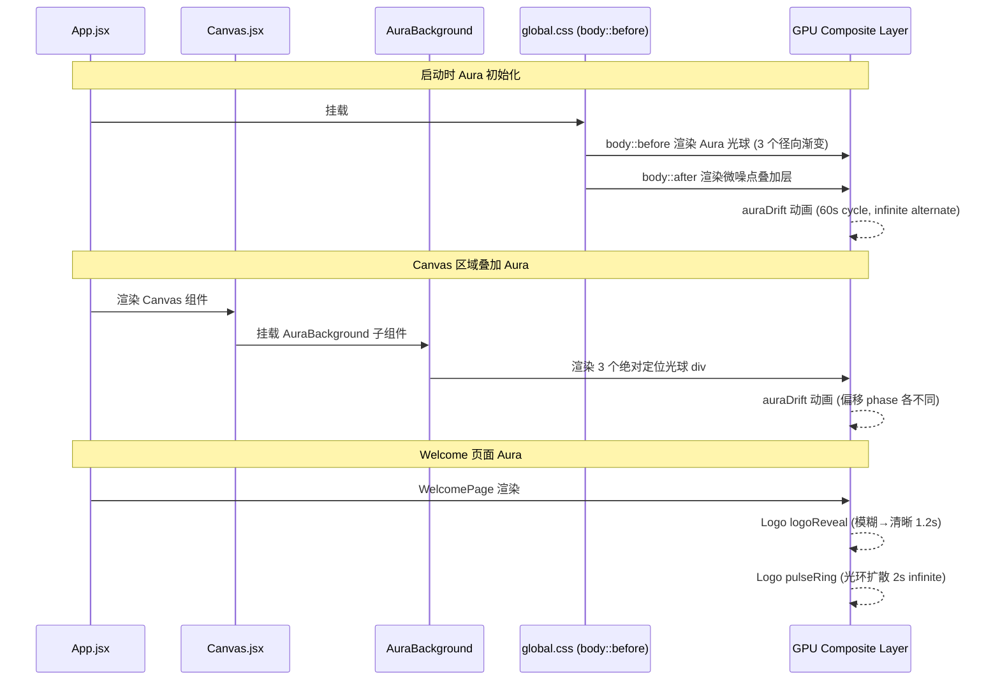
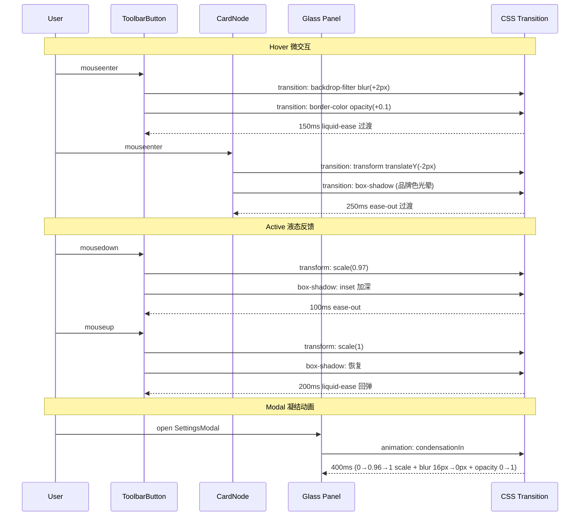
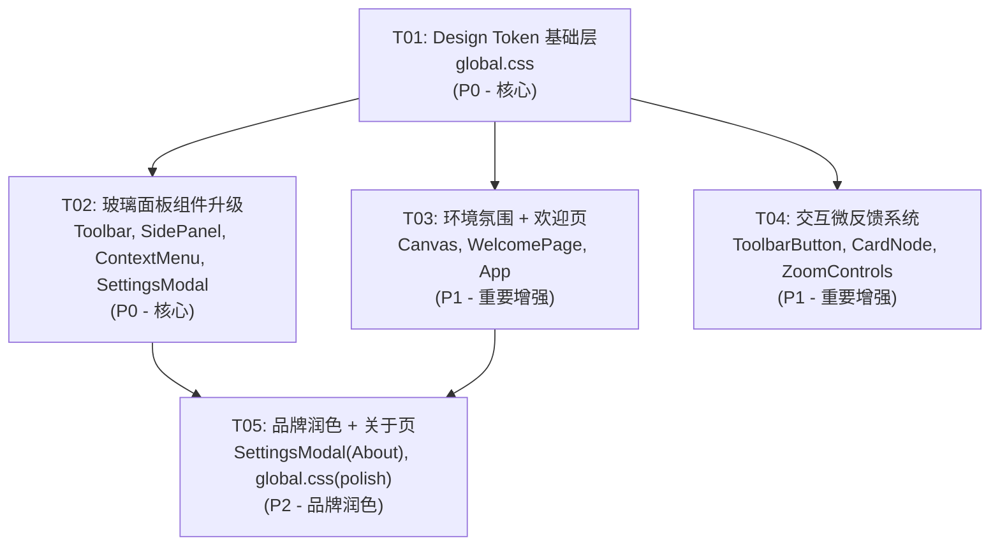
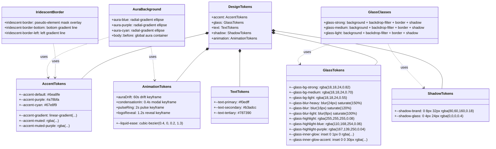

# ID Aura 液态玻璃 UI — 系统架构设计与任务分解

> **设计者**: Bob (Architect)  
> **版本**: v1.0  
> **日期**: 2026-06-23  
> **基准 PRD**: ID Aura 液态玻璃 UI 深化

---

## Part A: 系统设计

### A.1 实现方案

#### 核心思路

**纯 CSS Token 驱动的视觉升级**：不改组件逻辑，只换"皮肤"。所有视觉效果通过 CSS 自定义属性（Design Token）集中管控，组件只需替换 `className` 和少量内联 style 值。零新增依赖，零 JS 动画库。

#### 必须改的组件（8 个）

| 组件 | 改动原因 |
|------|----------|
| `global.css` | 新增 20+ token、改写 glass 类、新增动画 keyframes、Aura 背景 |
| `Toolbar.jsx` | 背景从 `surface-raised` 改为 glass-strong + 虹彩底部边框 |
| `SidePanel.jsx` | 背景从 `surface-raised` 改为 glass-medium + 虹彩左边框线 |
| `SettingsModal.jsx` | 弹窗面板 glass-strong 0.82 不透明 + 凝结入场动画 |
| `ContextMenu.jsx` | 右键菜单 glass-medium 升级到新 token |
| `Canvas.jsx` | 添加 Aura 光晕背景层（径向渐变光球） |
| `WelcomePage.jsx` | Logo 品牌动画 + pulse ring + Aura 光晕背景 |
| `ToolbarButton.jsx` | 按钮液态反馈：active 时 scale(0.97) + 内阴影 |
| `CardNode.jsx` | 玻璃 hover 微交互（blur +2px, border +0.1 opacity） |

#### 不需要改的组件（3 个）

| 组件 | 原因 |
|------|------|
| `CategoryCard.jsx` | 纯内容卡片，非玻璃面板，自动继承 token 色值 |
| `ZoomControls.jsx` | 已用 `glass-light` className，自动继承新 token |
| `App.jsx` | 纯布局壳，无样式改动（但可能需加 Aura 容器 wrapper） |

#### 不改动的文件

- `src/main.jsx` — 入口已正确引入 global.css，无需改动
- `index.html` — 无需改动（Aura 通过 CSS body 伪元素实现）
- `src/store/*` — 无状态逻辑变更
- `src/data/*` — 无数据变更
- `package.json` — 零新依赖

---

### A.2 CSS 变量变更表

#### 新增 Token（22 个）

| Token 名 | 值 | 用途 |
|----------|-----|------|
| `--accent-purple` | `#a78bfa` | 紫色强调色 |
| `--accent-cyan` | `#67e8f9` | 青色强调色（虹彩边缘） |
| `--accent-gradient` | `linear-gradient(135deg, #6ea8fe, #a78bfa)` | 蓝紫渐变（按钮/强调元素） |
| `--accent-muted-purple` | `rgba(167, 139, 250, 0.12)` | 紫色半透明背景 |
| `--glass-blur-heavy` | `blur(24px) saturate(150%)` | 高强度玻璃模糊（strong 面板） |
| `--glass-blur-light` | `blur(8px) saturate(100%)` | 低强度玻璃模糊（light 面板） |
| `--glass-bg-strong` | `rgba(18, 18, 24, 0.82)` | 高不透明玻璃背景 |
| `--glass-bg-medium` | `rgba(18, 18, 24, 0.70)` | 中不透明玻璃背景 |
| `--glass-bg-light` | `rgba(18, 18, 24, 0.55)` | 低不透明玻璃背景 |
| `--glass-highlight-blue` | `rgba(110, 168, 254, 0.06)` | 蓝色高光分量 |
| `--glass-highlight-purple` | `rgba(167, 139, 250, 0.04)` | 紫色高光分量 |
| `--glass-highlight-strong` | `rgba(255, 255, 255, 0.10)` | 强化白色高光 |
| `--glass-inner-glow` | `inset 0 1px 0 rgba(255,255,255,0.06)` | 面板内发光（上边缘） |
| `--glass-inner-glow-accent` | `inset 0 0 30px rgba(110,168,254,0.04)` | 面板内发光（accent色） |
| `--border-iridescent` | 见 A.5 方案 | 虹彩渐变边框（概念 token） |
| `--shadow-brand` | `0 8px 32px rgba(80, 60, 160, 0.18)` | 品牌色阴影 |
| `--shadow-glass` | `0 4px 24px rgba(0, 0, 0, 0.4)` | 玻璃面板阴影 |
| `--liquid-ease` | `cubic-bezier(0.4, 0, 0.2, 1.3)` | 液态弹性缓动函数 |
| `--aura-blue` | `radial-gradient(ellipse 600px 400px at 20% 50%, rgba(110,168,254,0.10), transparent)` | 蓝色光晕 |
| `--aura-purple` | `radial-gradient(ellipse 500px 350px at 80% 40%, rgba(167,139,250,0.08), transparent)` | 紫色光晕 |
| `--aura-cyan` | `radial-gradient(ellipse 300px 200px at 60% 80%, rgba(103,232,249,0.05), transparent)` | 青色光晕 |
| `--pulse-ring` | `0 0 0 0 rgba(110,168,254,0.4)` | Logo pulse 动画初始阴影 |

#### 修改 Token（8 个）

| Token 名 | 旧值 | 新值 | 原因 |
|----------|------|------|------|
| `--accent-default` | `#6ea8fe` | **不变**（保留作为纯色回退） | 渐变是新增的，不替换原值 |
| `--accent-hover` | `#8bb9fe` | `#9dc5fe` | 微调 hover 亮度适配紫色系 |
| `--accent-muted` | `rgba(110,168,254,0.12)` | `rgba(110,168,254,0.14)` | 略微增强半透明感 |
| `--accent-glow` | `rgba(110,168,254,0.25)` | `rgba(110,168,254,0.30)` | 增强光晕 |
| `--glass-bg` | `rgba(22,22,22,0.75)` | `rgba(18,18,24,0.70)` | 微调色相偏冷紫 + 配合新三层体系 |
| `--glass-blur` | `blur(16px)` | `blur(16px) saturate(120%)` | 增加饱和度 |
| `--glass-highlight` | `rgba(255,255,255,0.04)` | `rgba(255,255,255,0.08)` | 翻倍高光强度 |
| `--glass-border` | `rgba(255,255,255,0.06)` | `rgba(255,255,255,0.08)` | 略微增强边框可见度 |
| `--text-primary` | `#e8e8e8` | `#f0edff` | 轻微紫色偏调 |
| `--text-secondary` | `#9d9d9d` | `#b3adcc` | 紫色偏调 |
| `--text-tertiary` | `#666666` | `#787390` | 紫色偏调 |
| `--border-accent` | `rgba(110,168,254,0.35)` | `rgba(110,168,254,0.40)` | 增强 accent 边框 |
| `--elevation-3` | `0 8px 24px rgba(0,0,0,0.6)` | `0 8px 32px rgba(80,60,160,0.18), 0 4px 12px rgba(0,0,0,0.5)` | 双层阴影：品牌色 + 黑色 |
| `--glow-card-hover` | `0 0 20px rgba(110,168,254,0.08)` | `0 0 24px rgba(80,60,160,0.15)` | 品牌色 hover 光晕 |

#### 删除 Token（无）

所有旧 token 保留作为 fallback，不删除。

---

### A.3 文件变更列表

| # | 文件 | 操作 | 说明 |
|---|------|------|------|
| 1 | `src/styles/global.css` | **重写** | 新增/修改全部 Design Token、重写 `.glass-*` 类、新增 `@keyframes`（auraDrift, condensationIn, pulseRing, logoReveal）、新增 body Aura 伪元素、新增 `.iridescent-border` 工具类、新增全局 transition 升级 |
| 2 | `src/components/Toolbar.jsx` | **修改** | 背景改为 `glass-strong` + 虹彩底部边框（iridescent-border-bottom）、品牌文字改用 `--accent-gradient` |
| 3 | `src/components/SidePanel.jsx` | **修改** | 面板背景 `glass-medium` + 左侧虹彩 accent 线（iridescent-border-left）、搜索框 focus 光晕升级 |
| 4 | `src/components/SettingsModal.jsx` | **修改** | 弹窗面板 `glass-strong` 0.82 不透明 + 凝结入场动画 `condensationIn`、About tab 大尺寸液态玻璃面板 |
| 5 | `src/components/ContextMenu.jsx` | **修改** | 菜单容器 `glass-medium` 升级到新 token |
| 6 | `src/components/Canvas.jsx` | **修改** | 添加 `<AuraBackground />` 子组件（3 个径向渐变光球 + 漂移动画）、canvas-bg 微调适配 |
| 7 | `src/components/WelcomePage.jsx` | **修改** | Logo 添加 `pulseRing` + `logoReveal` 动画、拖放区升级 `glass-medium`、Aura 光晕背景 |
| 8 | `src/components/ToolbarButton.jsx` | **修改** | 添加 `:active` 伪类样式：`transform: scale(0.97)` + 内阴影加深、hover 时 blur 微升 |
| 9 | `src/components/CardNode.jsx` | **修改** | 玻璃 hover 微交互：hover 时 blur +2px + border-opacity +0.1、各子卡片 border 微调 |
| 10 | `src/components/ZoomControls.jsx` | **不改** | 已使用 `glass-light` className，自动继承新 token |
| 11 | `src/components/CategoryCard.jsx` | **不改** | 纯内容卡片，自动继承 token 色值 |
| 12 | `index.html` | **不改** | Aura 通过 CSS body 伪元素实现，无需 HTML 改动 |
| 13 | `src/main.jsx` | **不改** | 入口已正确引入 global.css |

---

### A.4 程序调用流（Aura 光晕渲染）



### A.5 组件交互流（玻璃 hover/active 微交互）



---

### A.5 虹彩边框实现方案（关键难点）

#### 问题

`border-image` 与 `border-radius` 不兼容：设置 `border-image` 后 `border-radius` 失效，边框变成直角。

#### 方案对比

| 方案 | 兼容 border-radius | 渐变支持 | 性能 | 代码复杂度 | 结论 |
|------|:--:|:--:|:--:|:--:|------|
| **A. 伪元素 mask overlay** | ✅ | ✅ | 🟡 多一个合成层 | 中 | ⭐ **最优** |
| B. outline + outline-offset: -1px | ✅ | ❌ 不支持渐变 | ✅ | 低 | 不可行 |
| C. box-shadow inset 模拟 | ✅ | ❌ 单色/简单渐变 | ✅ | 低 | 不可行 |
| D. clip-path 裁剪 | ✅ | ✅ | 🔴 重 | 高 | 过度设计 |
| E. 双层 div 嵌套 | ✅ | ✅ | 🟡 | 高 | 可行但 DOM 冗余 |

#### 选定方案：**方案 A — 伪元素 Mask Overlay**

```css
/* ===== 核心实现 ===== */
.iridescent-border {
  position: relative;
  /* 元素自身的 border-radius 正常设置 */
  border-radius: var(--radius-md);
  /* 移除原有 border，由伪元素接管 */
  border: none;
}

.iridescent-border::before {
  content: '';
  position: absolute;
  inset: 0;
  border-radius: inherit;          /* 继承父元素圆角 */
  padding: 1px;                    /* 边框宽度 */
  background: linear-gradient(
    135deg,
    rgba(110, 168, 254, 0.35) 0%,
    rgba(167, 139, 250, 0.35) 50%,
    rgba(103, 232, 249, 0.20) 100%
  );
  /* mask 技巧：只保留 padding 区域（即边框），挖空 content 区域 */
  -webkit-mask:
    linear-gradient(#fff 0 0) content-box,
    linear-gradient(#fff 0 0);
  -webkit-mask-composite: xor;
  mask:
    linear-gradient(#fff 0 0) content-box,
    linear-gradient(#fff 0 0);
  mask-composite: exclude;
  pointer-events: none;
  z-index: 0;
}

/* 确保内容在伪元素之上 */
.iridescent-border > * {
  position: relative;
  z-index: 1;
}
```

#### 选择理由

1. **完美兼容 border-radius**：`border-radius: inherit` 让渐变边框完美跟随任何圆角
2. **纯 CSS 无 DOM 污染**：不需要额外 wrapper div
3. **浏览器兼容性好**：`mask` / `-webkit-mask` 支持所有现代浏览器（Chrome 120+, Firefox 53+, Safari 15.4+）
4. **可组合**：可以定义 `.iridescent-border-top`、`.iridescent-border-left` 等方向变体
5. **GPU 友好**：伪元素会提升为独立合成层，不影响文档流

#### 方向变体

```css
/* 底部虹彩线（Toolbar 用） */
.iridescent-border-bottom::after {
  content: '';
  position: absolute;
  bottom: 0; left: 0; right: 0;
  height: 1px;
  background: linear-gradient(90deg,
    transparent 0%,
    rgba(110,168,254,0.35) 20%,
    rgba(167,139,250,0.35) 50%,
    rgba(103,232,249,0.20) 80%,
    transparent 100%
  );
  pointer-events: none;
}

/* 左侧虹彩线（SidePanel 用） */
.iridescent-border-left::after {
  content: '';
  position: absolute;
  left: 0; top: 0; bottom: 0;
  width: 1px;
  background: linear-gradient(180deg,
    rgba(110,168,254,0.35) 0%,
    rgba(167,139,250,0.35) 50%,
    rgba(103,232,249,0.15) 100%
  );
  pointer-events: none;
}
```

---

### A.6 待明确事项（风险点与假设）

| # | 风险点 | 说明 | 建议 |
|---|--------|------|------|
| 1 | **Firefox `saturate()` 兼容性** | Firefox 对 `backdrop-filter: saturate()` 的支持历史上不稳定（需 FF 103+） | 添加 `@supports (backdrop-filter: blur(16px) saturate(120%))` 渐进增强，fallback 纯 blur |
| 2 | **光晕动画性能** | 3 个径向渐变光球 + 60s CSS animation 持续运行，可能在低性能设备上造成 GPU 占用 | 添加 `@media (prefers-reduced-motion)` 禁用动画；使用 `will-change: transform` 提升光球到独立合成层 |
| 3 | **`mask-composite` 兼容性** | `mask-composite: exclude` 是较新属性，Chrome 120+ 才支持标准语法。Safari 需 `-webkit-mask-composite: xor` | 同时写 `-webkit-mask-composite: xor` 和 `mask-composite: exclude` 双重 fallback |
| 4 | **border-radius 对伪元素 mask 的影响** | 当元素 `overflow: hidden` 时，伪元素也会被裁剪 | 确保 `.iridescent-border` 不使用 `overflow: hidden`（目前 glass 面板没有 overflow:hidden 问题；SettingsModal 有，需改为内部 scroll 容器） |
| 5 | **Electron Chromium 版本** | Electron 28 内置 Chromium 120，`mask-composite` 标准语法已支持，但 `saturate()` 在 backdrop-filter 中可能有渲染差异 | 在 Electron 环境中实测确认 |
| 6 | **`--glass-bg` 色相调整影响面** | 从 `rgba(22,22,22,0.75)` 改为 `rgba(18,18,24,0.70)` 可能影响所有使用此 token 的地方 | 渐变迁移：新增 `--glass-bg-strong/medium/light` 三层，旧 `--glass-bg` 保留作为 fallback |
| 7 | **logoReveal 动画的模糊值** | `filter: blur()` 动画在低端 GPU 上可能掉帧 | 使用 `will-change: filter`，且在动画结束后移除 |

---

## Part B: 任务分解

### B.1 所需依赖包

无新增依赖。所有效果用纯 CSS 实现。

现有依赖清单（供参考）：
```
- react@^18.3.1: UI 框架
- react-dom@^18.3.1: React DOM
- zustand@^4.5.2: 状态管理
- lucide-react@^0.400.0: 图标库
- html2canvas@^1.4.1: 导出功能（已有）
```

### B.2 任务列表（按依赖顺序）

| 任务ID | 任务名 | 依赖 | 涉及文件 | 优先级 |
|--------|--------|------|----------|--------|
| **T01** | **Design Token 基础层** | 无 | `src/styles/global.css` | **P0** |
| **T02** | **玻璃面板组件升级** | T01 | `src/components/Toolbar.jsx`, `src/components/SidePanel.jsx`, `src/components/ContextMenu.jsx`, `src/components/SettingsModal.jsx` | **P0** |
| **T03** | **环境氛围 + 欢迎页** | T01 | `src/components/Canvas.jsx`, `src/components/WelcomePage.jsx`, `src/App.jsx` | **P1** |
| **T04** | **交互微反馈系统** | T01 | `src/components/ToolbarButton.jsx`, `src/components/CardNode.jsx`, `src/components/ZoomControls.jsx` | **P1** |
| **T05** | **品牌润色 + 关于页** | T02, T03 | `src/components/SettingsModal.jsx`（About tab）, `src/styles/global.css`（最终调优）, `index.html` | **P2** |

### B.3 任务详细说明

---

#### T01: Design Token 基础层 [P0]

**目标**: 在 `global.css` 中完成所有 CSS 基础设施变更，后续所有任务依赖此 token 体系。

**具体内容**:

1. **新增 CSS 变量**（22 个，见 A.2 表）
2. **修改 CSS 变量**（14 个，见 A.2 表）
3. **重写 `.glass-strong` / `.glass-medium` / `.glass-light` 类**：
   - glass-strong: `background: var(--glass-bg-strong)`, `backdrop-filter: var(--glass-blur-heavy)`, `box-shadow: var(--shadow-glass), var(--elevation-3)`
   - glass-medium: `background: var(--glass-bg-medium)`, `backdrop-filter: var(--glass-blur)`
   - glass-light: `background: var(--glass-bg-light)`, `backdrop-filter: var(--glass-blur-light)`
4. **新增虹彩边框工具类**：`.iridescent-border`, `.iridescent-border-bottom`, `.iridescent-border-left`（见 A.5 方案）
5. **新增 `@keyframes`**：
   - `auraDrift` — 光球缓慢漂移 (60s ease-in-out infinite alternate)
   - `condensationIn` — 弹窗凝结入场 (0.4s，scale 0→0.96→1, blur 16px→0, opacity 0→1)
   - `pulseRing` — Logo 光环脉冲 (2s ease-out infinite, box-shadow 扩散)
   - `logoReveal` — Logo 模糊→清晰 (1.2s, blur 8px→0, opacity 0→1)
6. **新增 body Aura 背景**：body::before 伪元素放置 3 个径向渐变光球
7. **修改全局 transition 工具类**：`.transition-fast/normal/slow` 改为使用 `--liquid-ease`
8. **修改文字色**：`--text-primary/secondary/tertiary` 微调偏紫色

**验收标准**:
- `:root` 中包含所有新增和修改的 token
- `.glass-strong/medium/light` 使用新 token 值
- body 背景有可见的 Aura 光晕
- 所有 @keyframes 定义完整

---

#### T02: 玻璃面板组件升级 [P0]

**目标**: 将 4 个核心面板组件从旧玻璃风格升级为新液态玻璃风格。

**前置依赖**: T01（需要新 token 和 glass 类）

**具体内容**:

| 文件 | 改动 |
|------|------|
| `Toolbar.jsx` | 外容器 `style.background` 从 `var(--surface-raised)` 改为 `className="glass-strong iridescent-border-bottom"`；品牌名 `"ID Aura"` 文字色从 `var(--text-primary)` 改为渐变（可在 global.css 定义 `.brand-text` 类） |
| `SidePanel.jsx` | 外容器从 `background: var(--surface-raised)` + `borderRight` 改为 `className="glass-medium iridescent-border-left"`；搜索框 focus 状态 `boxShadow` 值从 `var(--accent-glow)` 升级 |
| `ContextMenu.jsx` | `className="glass-medium"` 保持不变，自动继承新 token（确认 `data-context-menu` 属性不干扰） |
| `SettingsModal.jsx` | 面板 `className="glass-strong"` 保持不变，需确认自动继承 0.82 不透明度；入场动画从 `menuFadeIn` 改为 `condensationIn`；Overlay 背景从 `rgba(0,0,0,0.55)` 微调适配 |

**验收标准**:
- Toolbar 背景呈现液态玻璃质感 + 底部虹彩渐变线
- SidePanel 呈现玻璃质感 + 左侧虹彩渐变线
- SettingsModal 弹窗入场有凝结动画效果

---

#### T03: 环境氛围 + 欢迎页 [P1]

**目标**: 添加画布 Aura 光晕背景和启动页品牌动画。

**前置依赖**: T01（需要 `auraDrift` 动画和 `--aura-*` token）

**具体内容**:

| 文件 | 改动 |
|------|------|
| `Canvas.jsx` | 在 canvas 容器内添加 `<AuraBackground />` 子组件：3 个绝对定位 div，各带径向渐变背景 + `auraDrift` 动画（不同 delay）；anchor 点使用 `--aura-blue/--aura-purple/--aura-cyan` token；`pointer-events: none` 确保不干扰画布交互 |
| `WelcomePage.jsx` | Logo 区域（Palette icon + "ID Aura" 标题 + v2.4 版本号）包裹在 `.logo-brand` 容器中：Logo icon 添加 `pulseRing` 动画光环；整个容器添加 `logoReveal` 入场动画；背景添加 Aura 光晕（复用 body 全局 Aura 或独立光球）；拖放区 `.glass-medium` 保持自动继承 |
| `App.jsx` | 无需结构性改动，确认 `WelcomePage` 条件渲染不影响 Aura 全局背景 |

**验收标准**:
- 画布背景可见缓慢漂移的蓝紫色光球
- 欢迎页 Logo 有脉冲光环动画和模糊→清晰入场
- 漂移动画流畅不卡顿

---

#### T04: 交互微反馈系统 [P1]

**目标**: 按钮和卡片的液态反馈微交互。

**前置依赖**: T01（需要 `--liquid-ease` 和 token 值）

**具体内容**:

| 文件 | 改动 |
|------|------|
| `ToolbarButton.jsx` | CSS-in-JS 内联样式增加：`:active` 状态通过 `onMouseDown/onMouseUp` 事件 + state 实现 `transform: scale(0.97)` + `boxShadow: inset 0 2px 8px rgba(0,0,0,0.3)`；hover 时 `backdrop-filter` 增加 blur(+2px)；原有 `transition` 从 `150ms ease-out` 改为 `150ms var(--liquid-ease)` |
| `CardNode.jsx` | 各子卡片（ImageCard, SpecCard, LabelCard, NoteCard, DrawingCard）的 hover 样式升级：hover 时增加 `filter: brightness(1.05)` + border 颜色微调（opacity +0.1）；`transition` 使用 `var(--liquid-ease)` |
| `ZoomControls.jsx` | 本身无需改动（已用 glass-light），但确认 ZoomBtn 的 hover `scale(1.1)` 使用 `var(--liquid-ease)` 过渡 |

**验收标准**:
- 点击工具栏按钮有 scale(0.97) 按压反馈
- 按钮 hover 时玻璃模糊轻微增强
- 卡片 hover 有亮度微升 + 边框增强

---

#### T05: 品牌润色 + 关于页 [P2]

**目标**: 关于页大尺寸液态玻璃面板 + 最终 token 调优。

**前置依赖**: T02（SettingsModal 已升级）, T03（Aura 已就位）

**具体内容**:

| 文件 | 改动 |
|------|------|
| `SettingsModal.jsx` | AboutTab 组件内部：将信息卡片（作者、开源协议）区域包裹为大尺寸 `glass-strong` 面板（`className="glass-strong iridescent-border"`）；添加内发光 `boxShadow: var(--glass-inner-glow-accent)`；QR 码卡片升级为 `glass-medium` |
| `global.css` | 最终 token 微调：对比度检查（text-primary 在 glass 背景上可读性）、`--shadow-brand` 扩散范围微调、`--glass-highlight-blue/purple` 比例调整、确保 `@media (prefers-reduced-motion)` 包裹所有动画 |
| `index.html` | 确认无遗漏（当前无改动需求，保留检查） |

**验收标准**:
- 关于页呈现大尺寸液态玻璃面板，有内发光效果
- 整体视觉协调统一
- `prefers-reduced-motion` 用户不受动画影响

---

### B.4 共享知识

```
- 本项目是纯 CSS 驱动升级，零 JS 动画库依赖
- 所有 CSS 变量定义在 src/styles/global.css 的 :root 中
- 组件使用 className 或内联 style 引用 CSS 变量
- backdrop-filter 需要 -webkit-backdrop-filter 前缀（Safari 兼容）
- mask / mask-composite 需要 -webkit- 前缀（Safari）
- 所有动画需包裹 @media (prefers-reduced-motion: no-preference)
- 光晕元素必须设置 pointer-events: none
- Electron 28 内置 Chromium 120，支持 mask-composite 标准语法
- 应用使用 React 18 + Zustand 状态管理，组件为函数式组件
```

### B.5 任务依赖图



### B.6 数据流图（类图 — Design Token 体系）



---

## 附录：实现优先级路线图

```
Phase 1 (P0) — 核心必须实现
  T01 → T02
  产出：所有玻璃面板呈现液态玻璃质感 + 虹彩边框

Phase 2 (P1) — 重要增强
  T03, T04（可并行）
  产出：Aura 光晕背景 + 品牌动画 + 交互微反馈

Phase 3 (P2) — 品牌润色
  T05
  产出：关于页液态面板 + 整体视觉调优
```
