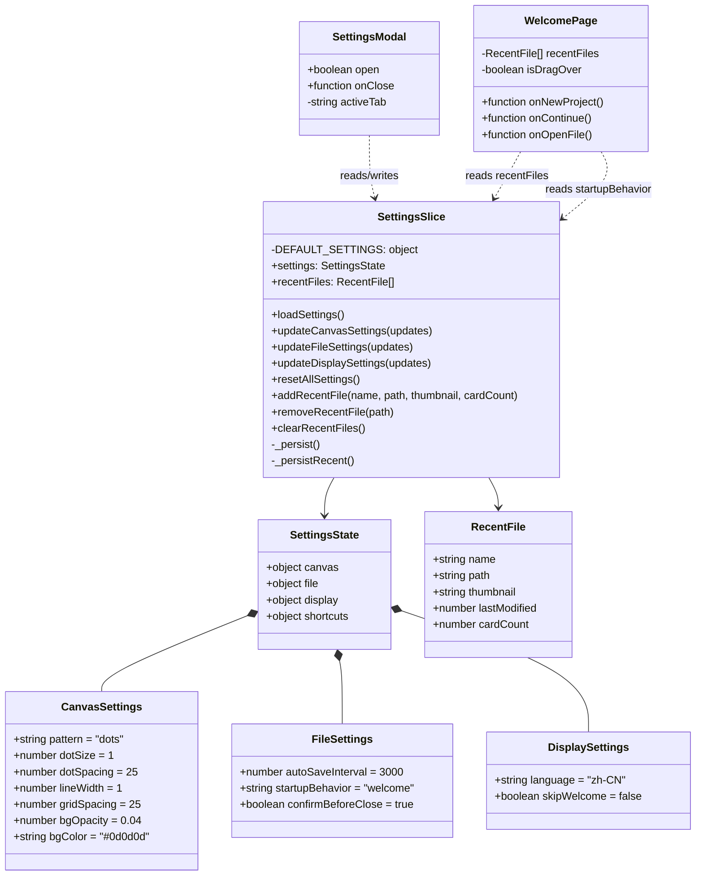
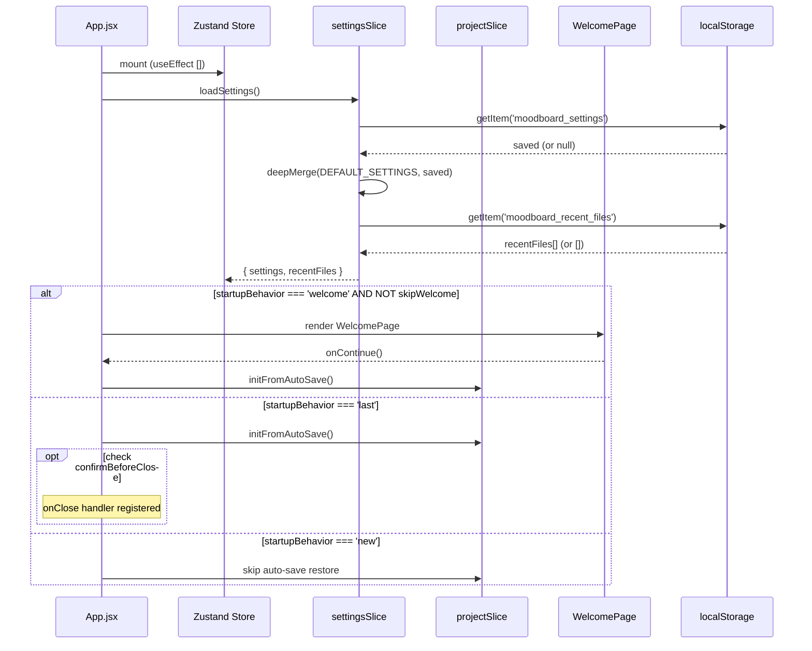
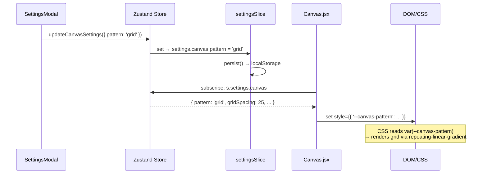
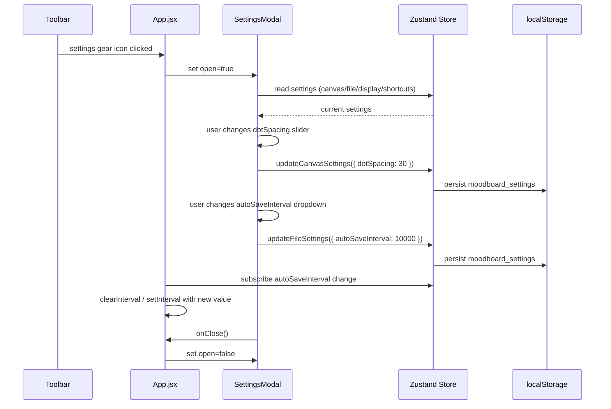
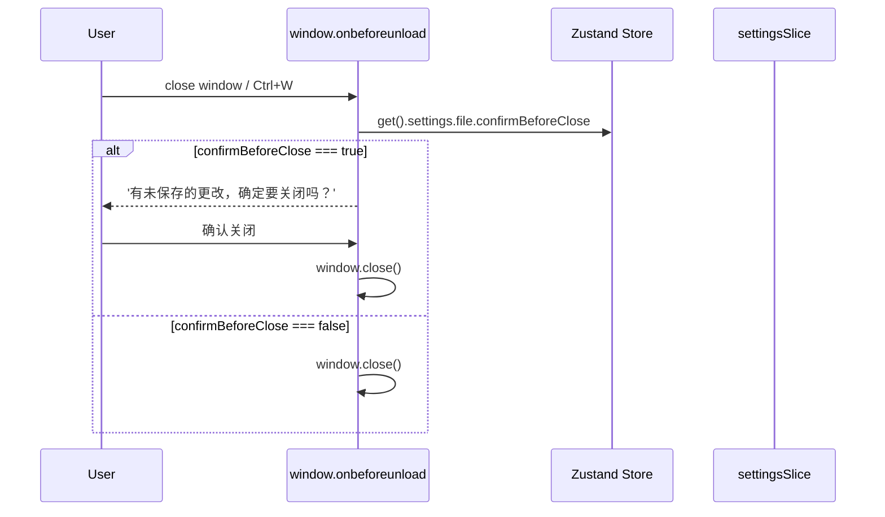
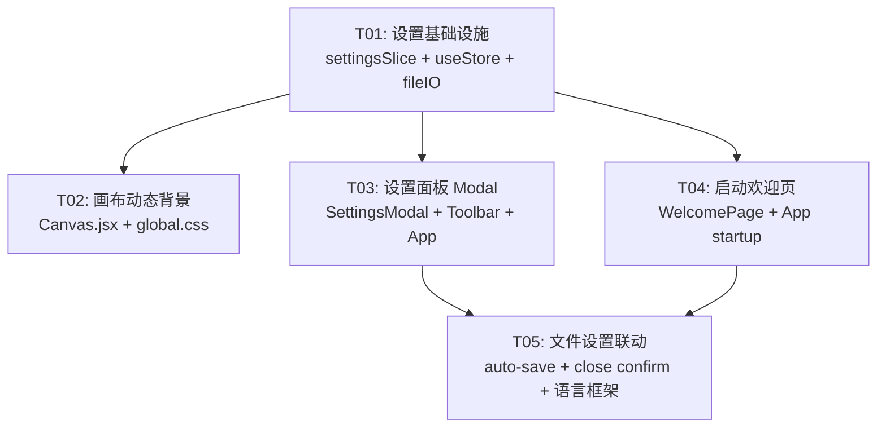

# 设计规范灵感图版 v2.4 — 系统设计方案

> **作者**: 高见远（Bob, Architect）
> **日期**: 2026-06-23
> **基于**: PRD v2.0（来自 Alice / Product Manager）

---

## Part A: 系统设计

---

### 1. 实现方案（Implementation Approach）

#### 核心技术挑战

| 挑战 | 分析 | 方案 |
|------|------|------|
| 画布背景从硬编码 CSS → 动态可切换 | `.canvas-bg` 用 `radial-gradient` + `::before`/`::after` 伪元素硬编码 | CSS custom properties + inline style 驱动，Canvas 组件读取 settings 后通过 `style` 属性设置 CSS 变量 |
| 设置持久化 | 现有只有 `moodboard_autosave` 一个 key | 独立 `moodboard_settings` key + 深层 merge 默认值 |
| 启动流程分支 | 当前 mount → `initFromAutoSave()` 一条路径 | mount → `loadSettings()` → 判断 `startupBehavior` → WelcomePage 或直接进主界面 |
| 不破坏现有 5 个 slice | 新增 slice 需保证零破坏 | `settingsSlice` 是完全独立的 orthogonal concern，仅通过 `get()` 读取其他 slice 作为只读源 |

#### 框架/库选择

| 需求 | 选择 | 理由 |
|------|------|------|
| 状态管理 | Zustand（已有） | 新增 slice 即可，无需任何新依赖 |
| UI 组件 | 全部 inline-style + CSS Variables（已有设计系统） | 遵循 v2.3 glass 设计系统 |
| 图标 | lucide-react（已有） | 使用 `Settings` / `Monitor` / `Grid3X3` / `LayoutGrid` 等图标 |
| 缩略图生成 | Canvas API（浏览器原生） | 无需额外依赖，`html2canvas` 太重 |

**无需新增任何 npm 依赖。**

#### 架构模式

```
┌─────────────────────────────────────────────┐
│                    App.jsx                    │
│  startup: loadSettings → routeTo(WelcomePage│
│           OR mainCanvas)                     │
│  runtime: SettingsModal ←→ Toolbar gear btn  │
├─────────────────────────────────────────────┤
│              Zustand Store                    │
│  ┌──────────┐ ┌──────────┐ ┌──────────────┐ │
│  │ 6 slices │ │ card     │ │ settings(NEW)│ │
│  │(existing)│ │ canvas   │ │   settings   │ │
│  │          │ │ project  │ │   load/save  │ │
│  │          │ │ selection│ │   update     │ │
│  │          │ │ history  │ │   reset      │ │
│  └──────────┘ └──────────┘ └──────────────┘ │
├─────────────────────────────────────────────┤
│              localStorage                     │
│  moodboard_settings      (新增)              │
│  moodboard_recent_files  (新增)              │
│  moodboard_autosave      (已有，不变)        │
└─────────────────────────────────────────────┘
```

---

### 2. 文件变更清单（File List）

#### 新建文件

| # | 文件相对路径 | 对应需求 | 说明 |
|---|-------------|----------|------|
| 1 | `src/store/settingsSlice.js` | R1,R4,R5,R7,R8,R10 | 设置状态 slice |
| 2 | `src/components/SettingsModal.jsx` | R1,R2,R4,R5,R7,R8,R9,R10 | 设置面板 Modal（含四个分类 + 预览窗） |
| 3 | `src/components/WelcomePage.jsx` | R3,R6 | 启动欢迎页 |

#### 修改文件

| # | 文件相对路径 | 对应需求 | 说明 |
|---|-------------|----------|------|
| 4 | `src/store/useStore.js` | R1-R11 | 注册 settingsSlice |
| 5 | `src/store/projectSlice.js` | R5,R7 | 新增 `confirmBeforeClose` 状态，`loadSettings` 回调 |
| 6 | `src/App.jsx` | R3,R5,R7,R10 | 启动流程重写、设置面板集成、关闭确认、自动保存间隔 |
| 7 | `src/components/Canvas.jsx` | R1,R4 | CSS 变量驱动动态背景 |
| 8 | `src/components/Toolbar.jsx` | R2 | 添加设置齿轮按钮 |
| 9 | `src/styles/global.css` | R1,R4 | 移除硬编码 `.canvas-bg`，添加 CSS 变量 fallback |
| 10 | `src/utils/fileIO.js` | R5,R6,R7 | 设置读写、最近文件管理、缩略图生成 |

---

### 3. 数据结构与接口（Data Structures & Interfaces）



---

### 4. 程序调用流程（Program Call Flow）

#### 4.1 应用启动流程



#### 4.2 画布背景切换流程



#### 4.3 设置面板交互流程



#### 4.4 关闭确认流程



---

### 5. 待确认事项（Anything UNCLEAR）

| # | 问题 | 假设 |
|---|------|------|
| 1 | 设置面板是否需要"应用"按钮还是即时生效？ | **即时生效**（对标 PureRef，所有修改立即写入 localStorage 并反映到 UI） |
| 2 | 最近文件缩略图生成策略：何时生成？ | **auto-save 时生成**（在 `saveAutoSave` 中调用 `generateThumbnail()`），缩略图存 base64 data URI |
| 3 | 缩略图尺寸？ | **280×180px**，JPEG 0.6 质量，存储为 base64 |
| 4 | `confirmBeforeClose` 在 Electron 环境如何触发？ | 使用 `window.onbeforeunload` + 检查 `settings.file.confirmBeforeClose`；Electron 侧监听 `close` 事件发送 IPC |
| 5 | `showSidePanel` 的双重身份（projectSlice 运行时 + settings 持久化）？ | 保留在 `projectSlice` 作为运行时状态，`loadSettings()` 时用 settings 中的值覆盖初始值；侧面板的 toggle 同时更新 settings |
| 6 | 语言切换是否需要实时生效？ | **v2.4 仅预留框架**。存储 language 值但所有 UI 文本仍写死中文，只留 `useLanguage()` hook 占位 |

---

## Part B: 任务分解

---

### 6. 所需依赖包（Required Packages）

```
无新增依赖。所有功能基于现有包实现：
- react@^18.3.1: UI 框架
- zustand@^4.5.2: 状态管理（现有，新增 slice）
- lucide-react@^0.400.0: 图标（现有，使用 Settings/Grid3X3/BringToFront 等）
- html2canvas@^1.4.1: 缩略图生成（现有，仅用于导出，缩略图用原生 Canvas API）
```

---

### 7. 任务列表（Task List）

| ID | 任务 | 涉及文件 | 依赖 | 优先级 | 说明 |
|----|------|---------|------|--------|------|
| **T01** | **设置基础设施 — Settings Slice + 持久化** | `src/store/settingsSlice.js`（新）、`src/store/useStore.js`（改）、`src/utils/fileIO.js`（改） | 无 | P0 | 创建设置 slice（含 DEFAULT_SETTINGS + load/save/persist），集成到 useStore，fileIO 新增 `loadSettings`/`saveSettings`/`loadRecentFiles`/`saveRecentFiles` |
| **T02** | **画布动态背景 — CSS Variables 驱动** | `src/components/Canvas.jsx`（改）、`src/styles/global.css`（改）、`src/store/settingsSlice.js`（改） | T01 | P0 | 移除 `.canvas-bg` 硬编码，Canvas 读取 `settings.canvas` 后通过 inline style 设置 CSS 自定义属性，支持 dots/grid/solid 三种模式 + 参数滑块值 |
| **T03** | **设置面板 Modal — SettingsModal + Toolbar 入口** | `src/components/SettingsModal.jsx`（新）、`src/components/Toolbar.jsx`（改）、`src/App.jsx`（改） | T01 | P0 | 左侧 Tab 导航（画布/文件/显示/快捷键）+ 右侧内容区，四个分类设置区域，画布背景预览窗（120×80），即时生效 + 持久化 |
| **T04** | **启动欢迎页 — WelcomePage + 最近文件** | `src/components/WelcomePage.jsx`（新）、`src/App.jsx`（改）、`src/utils/fileIO.js`（改） | T01 | P0 | 三入口按钮 + 拖拽区域 + 最近文件缩略图卡片列表，`generateThumbnail()` 缩略图生成，App 启动流程分支 |
| **T05** | **文件设置联动 + 最终集成** | `src/App.jsx`（改）、`src/store/projectSlice.js`（改）、`src/utils/fileIO.js`（改）、`src/styles/global.css`（改） | T03, T04 | P1 | 自动保存间隔动态配置、关闭前确认对话框、语言框架预留 hook、快捷键只读列表、`skipWelcome` 逻辑、欢迎页内嵌样式 |

---

### 8. 共享知识（Shared Knowledge）

#### CSS Custom Properties 命名规范

```css
/* 画布背景 — 由 Canvas.jsx inline style 动态设置 */
--canvas-pattern: 'dots';            /* 'dots' | 'grid' | 'solid' */
--canvas-dot-size: 1px;              /* 点阵模式：点半径 */
--canvas-dot-spacing: 25px;          /* 点阵模式：间距 */
--canvas-dot-color: rgba(255,255,255,0.04);  /* 点阵颜色（由 bgOpacity 计算） */
--canvas-line-width: 1px;           /* 网格模式：线宽 */
--canvas-grid-spacing: 25px;        /* 网格模式：间距 */
--canvas-line-color: rgba(255,255,255,0.04);  /* 网格线颜色 */
--canvas-bg-color: #0d0d0d;         /* 纯色模式 / 基础背景色 */

/* 旧变量保留（向后兼容） */
--bg: var(--surface-base);
/* ... 其他不变 */
```

#### 设置默认值常量（`settingsSlice.js`）

```js
export const DEFAULT_SETTINGS = {
  canvas: {
    pattern: 'dots',        // 'dots' | 'grid' | 'solid'
    dotSize: 1,             // 1–6 px
    dotSpacing: 25,         // 10–60 px
    lineWidth: 1,           // 1–4 px
    gridSpacing: 25,        // 10–60 px
    bgOpacity: 0.04,        // 0.01–0.20
    bgColor: '#0d0d0d',
  },
  file: {
    autoSaveInterval: 3000,     // 1000|3000|5000|10000|30000
    startupBehavior: 'welcome', // 'welcome'|'last'|'new'
    confirmBeforeClose: true,
  },
  display: {
    language: 'zh-CN',      // 'zh-CN'|'en'
    skipWelcome: false,
  },
  shortcuts: {},            // v2.5 reserved
}
```

#### 缩略图约定

- **尺寸**: 280 × 180 px（16:10 近似比例）
- **格式**: JPEG, quality 0.6 → base64 data URI
- **生成时机**: `autoSave()` 调用时（在 `projectSlice.autoSave` 中触发 `settingsSlice.generateThumbnail()`）
- **存储位置**: `localStorage.moodboard_recent_files`（最多 10 条）
- **最近文件结构**:
  ```json
  [{ "name": "灵感图版_2026-06-23.moodboard", "path": "/path/to/file.moodboard",
     "thumbnail": "data:image/jpeg;base64,...", "lastModified": 1719123456789, "cardCount": 15 }]
  ```

#### 全局约定

- 所有设置修改即时生效，不需要"应用/取消"按钮
- 设置面板打开时，不阻挡画布操作（Modal 为非模态 overlay）
- CSS class 命名遵循现有 `.glass-*` 体系
- 快捷键列表为只读展示，v2.5 才支持自定义
- `loadProject` 时记录到最近文件列表
- `initFromAutoSave` 成功恢复时也记录到最近文件列表（如果 auto-save 中有卡片）
- 关闭确认使用 `window.onbeforeunload`（Web）+ Electron IPC `close` 事件

---

### 9. 任务依赖图（Task Dependency Graph）



**关键说明**:
- T01 是所有任务的**硬性前置依赖**（所有任务需要 settings slice 的 state shape 和 actions）
- T02 和 T03 可并行（一个改 Canvas 渲染层，一个新建 UI 组件）
- T04 依赖 T01（需要 recent files 基础 + loadSettings），但可与 T02/T03 并行
- T05 是收尾任务，需要等 T03（设置面板可用）和 T04（启动流程可用）完成后做最终集成

---

## 附录：关键接口签名

### settingsSlice.js

```js
export const createSettingsSlice = (set, get) => ({
  settings: { ...DEFAULT_SETTINGS },
  recentFiles: [],

  // 从 localStorage 加载设置 + 最近文件
  loadSettings: () => { /* deepMerge defaults + saved, sync showSidePanel */ },

  // 画布设置（即时生效 + 持久化）
  updateCanvasSettings: (updates) => { /* partial update + _persist */ },

  // 文件设置
  updateFileSettings: (updates) => { /* partial update + _persist */ },

  // 显示设置
  updateDisplaySettings: (updates) => { /* partial update + _persist */ },

  // 重置全部为默认
  resetAllSettings: () => { /* merge DEFAULT_SETTINGS + _persist */ },

  // 最近文件管理
  addRecentFile: (name, path, thumbnail, cardCount) => { /* prepend, max 10, _persistRecent */ },
  removeRecentFile: (path) => { /* filter + _persistRecent */ },
  clearRecentFiles: () => { /* set [] + _persistRecent */ },

  // 缩略图生成（通过 Canvas API 截图）
  generateThumbnail: async () => { /* canvas.toDataURL('image/jpeg', 0.6) */ },

  // 内部持久化
  _persist: () => { /* localStorage.setItem('moodboard_settings', ...) */ },
  _persistRecent: () => { /* localStorage.setItem('moodboard_recent_files', ...) */ },
})
```

### projectSlice.js 增量

```js
// 新增/修改的 actions：

// autoSave 增加：生成缩略图 + 更新最近文件
autoSave: () => {
  const { cards, canvas, customSpecs } = get()
  saveAutoSave({ cards, canvas, customSpecs })
  // 如果 cards 非空，生成缩略图并记录到最近文件
  if (cards.length > 0) {
    get().generateThumbnail?.()  // 由 settingsSlice 提供
  }
},

// 新增：判断是否有未保存更改（cardCount > 0）
hasUnsavedChanges: () => get().cards.length > 0,
```

### SettingsModal.jsx

```jsx
// Props
{
  open: boolean,       // 是否显示
  onClose: () => void, // 关闭回调
}

// 内部结构：
// 左侧 Tab: [画布] [文件] [显示] [快捷键]
// 右侧内容：
//   画布 Tab: 模式选择(点状/网格/纯色) + 参数滑块(点大小/间距/线宽/透明度/颜色)
//             + 背景预览窗 120×80px
//   文件 Tab: 自动保存间隔下拉 + 启动行为选择 + 关闭前确认开关
//   显示 Tab: 界面语言下拉 + 跳过欢迎页开关
//   快捷键 Tab: 只读快捷键列表（Ctrl+Z/Ctrl+V/Ctrl+G/...）
```

### WelcomePage.jsx

```jsx
// Props
{
  onNewProject: () => void,      // 新建空白项目
  onContinue: () => void,        // 继续上次（恢复 auto-save）
  onOpenFile: (path) => void,    // 打开最近文件
  recentFiles: RecentFile[],     // 最近文件列表（来自 settingsSlice）
}

// 布局：
// 中央区域：拖拽导入区（虚线边框 + "拖拽图片到此处或点击导入"）
// 下方：最近文件缩略图卡片横排列表（280×180 缩略图 + 文件名 + 卡片数）
// 顶部：三个入口按钮（新建 / 继续 / 打开）
```
